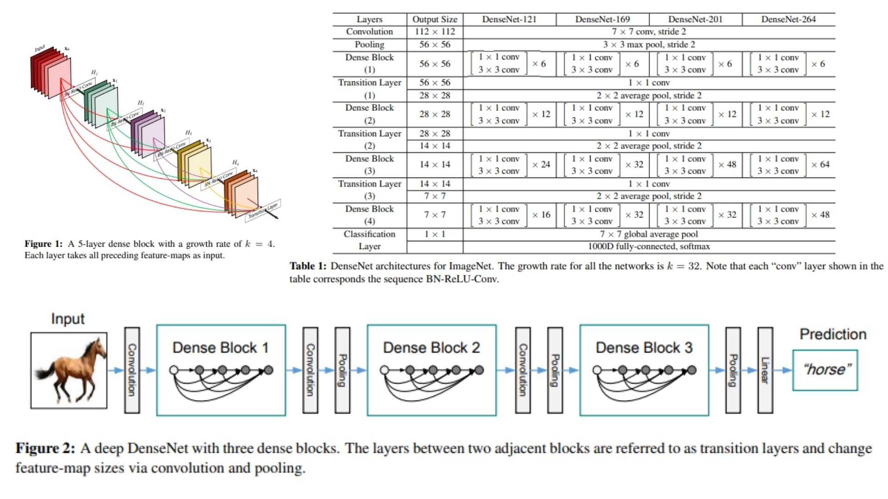

# 🎆 DenseNet PyTorch Implementation

This repository contains a replication of **DenseNet (Densely Connected Convolutional Networks)** using PyTorch. The goal is to reproduce the **DenseNet-121 architecture** with dense and transition layers for ImageNet classification.

- Only **DenseNet-121** has been implemented.  
- Architecture follows **Conv1 → DenseBlock1 → Transition1 → DenseBlock2 → Transition2 → DenseBlock3 → Transition3 → DenseBlock4 → AvgPool → Flatten → FC** sequence.  
**Paper**: [Densely Connected Convolutional Networks (CVPR 2017)](https://arxiv.org/abs/1608.06993)

> 🛠️ Users may need to adjust the code slightly to implement other DenseNet variants (DenseNet-169, 201, 264) or custom architectures.
---
## 🖼 Overview – DenseNet Architecture

  

- **Figure 1:** Dense connectivity pattern. Each layer receives feature-maps from all previous layers via concatenation, which improves gradient flow and enables feature reuse.  
- **Figure 2:** Transition layers between dense blocks. These layers reduce the spatial size of feature-maps using 2×2 average pooling and can also compress the number of channels to keep the network efficient.  
- **Table 1:** DenseNet-121 configuration, showing the number of layers in each dense block and the growth rate for new feature-maps.

> DenseNet is a convolutional neural network that connects each layer to all previous layers, letting it reuse features and improve gradient flow. Inside each dense block, layers usually do batch normalization, ReLU activation, and a 3×3 convolution. Optional 1×1 bottleneck layers can reduce input size to make computation lighter. Between dense blocks, transition layers shrink the feature-map size and can compress channels. At the end, global average pooling feeds into a fully connected layer to produce the final predictions. This design makes DenseNet efficient, compact, and good for large-scale image recognition.

---

## 🏗 Project Structure

```bash
DenseNet-Replicating/
│
├── src/
│   ├── layers/
│   │   ├── dense_layer.py         # Single dense layer: BN → ReLU → Conv3x3 + concat previous feature-maps
│   │   ├── transition_layer.py    # 1x1 Conv + AvgPooling (reduces feature-map size)
│   │   ├── conv1.py               # Initial 7x7 Conv + BN + ReLU
│   │   ├── pool_layers/
│   │   │   ├── maxpool_layer.py   # MaxPool after conv1
│   │   │   └── avgpool_layer.py   # Global Average Pooling after last block
│   │   ├── flatten_layer.py       # Conv → FC transition
│   │   └── fc_layer.py            # Fully Connected Layer (1000 classes)
│   │
│   ├── model/
│   │   └── densenet121.py         # Full DenseNet-121: Conv1 → DenseBlocks → Transitions → AvgPool → Flatten → FC
│   │
│   └── config.py                  # Hyperparameters
│
├── requirements.txt
└── README.md
```
---

## 🔗 Feedback

For questions or feedback, contact: [barkin.adiguzel@gmail.com](mailto:barkin.adiguzel@gmail.com)

